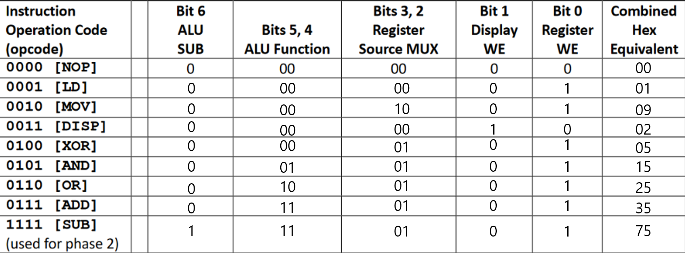
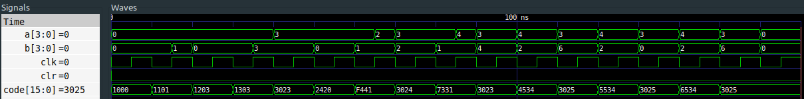

# 4-Bit CPU

[English](README.md)

**Logisim**(시각적 회로 설계)과 **Verilog HDL**(시뮬레이션)로 밑바닥부터 설계한 4-bit CPU입니다.

**[브라우저에서 바로 실행해보기](https://simdasong.github.io/4-bit-cpu/)** — 설치 없이 어셈블리를 작성하고 한 단계씩 실행할 수 있습니다.

[Electronics Stack Exchange의 회로](https://electronics.stackexchange.com/questions/367541/how-to-write-a-program-for-4-bit-cpu-made-in-logisim)를 참고하여 시작했지만, 원본 회로를 그대로 복제할 수 없는 문제가 있어 회로를 수정했습니다. 명령어 집합과 명령어 디코더 매핑은 직접 설계했습니다.

## 아키텍처

**싱글 사이클** 설계로, 모든 명령어가 1 클럭 사이클 안에 실행됩니다.


### 구성 요소

| 구성 요소 | 설명 |
|-----------|------|
| **명령어 디코더** | 4-bit opcode를 7-bit 제어 신호(SUB, AFS, RSS, DWE, WE)로 디코딩 |
| **3-Port 레지스터 파일** | 8개의 범용 4-bit 레지스터 (R0–R7), 읽기 포트 2개 + 쓰기 포트 1개 |
| **ALU** | 4가지 연산 — XOR, AND, OR, ADD/SUB (2의 보수 뺄셈) |
| **4-to-1 MUX** | 쓰기 데이터 소스 선택: 즉시값, ALU 결과, 레지스터 값 |
| **8-to-1 MUX** | 읽기 포트의 레지스터 출력 선택 |
| **3-to-8 디코더** | 레지스터 주소를 원-핫 인에이블 신호로 변환 |

## 명령어 집합

16-bit 명령어 포맷:

```
[15:12]  [11]  [10:8]  [7]  [6:4]  [3]  [2:0]
opcode    -    Addr D   -   Addr A   -   Addr B / Data
```

| Opcode | 니모닉 | 동작 | 어셈블리 포맷 | 머신 코드 |
|--------|--------|------|---------------|----------|
| `0000` | NOP | 동작 없음 | `NOP` | `0000 0000 0000 0000` |
| `0001` | LD | Rd ← Data | `LD Rd, Data` | `0001 0ddd 0000 Data` |
| `0010` | MOV | Rd ← Ra | `MOV Rd, Ra` | `0010 0ddd 0aaa 0000` |
| `0011` | DISP | (Ra, Rb)를 ASCII 디스플레이에 출력 | `DISP Ra, Rb` | `0011 0000 0aaa 0bbb` |
| `0100` | XOR | Rd ← Ra XOR Rb | `XOR Rd, Ra, Rb` | `0100 0ddd 0aaa 0bbb` |
| `0101` | AND | Rd ← Ra AND Rb | `AND Rd, Ra, Rb` | `0101 0ddd 0aaa 0bbb` |
| `0110` | OR | Rd ← Ra OR Rb | `OR Rd, Ra, Rb` | `0110 0ddd 0aaa 0bbb` |
| `0111` | ADD | Rd ← Ra + Rb | `ADD Rd, Ra, Rb` | `0111 0ddd 0aaa 0bbb` |
| `1111` | SUB | Rd ← Ra - Rb | `SUB Rd, Ra, Rb` | `1111 0ddd 0aaa 0bbb` |

### 명령어 디코더 제어 신호

각 opcode는 7-bit 제어 워드로 매핑됩니다:

| 비트 | 신호 | 설명 |
|-----|------|------|
| 6 | SUB | ALU 뺄셈 플래그 |
| 5:4 | AFS | ALU 기능 선택 (00=XOR, 01=AND, 10=OR, 11=ADD/SUB) |
| 3:2 | RSS | 레지스터 소스 MUX 선택 |
| 1 | DWE | 디스플레이 쓰기 인에이블 |
| 0 | WE | 레지스터 쓰기 인에이블 |




## 프로젝트 구조

```
├── 4-bit-cpu.circ            # Logisim 회로 파일
├── cpu.v                     # CPU 최상위 모듈 (명령어 디코더 + 데이터패스)
├── alu.v                     # 산술 논리 연산 장치
├── three_port_reg_file.v     # 8 x 4-bit 레지스터 파일 (3 포트)
├── cpu_tb.v                  # 테스트벤치 (예제 프로그램 포함)
├── mux_4to1.v                # 4-to-1 멀티플렉서
├── mux_8to1.v                # 8-to-1 멀티플렉서
├── decoder_3to8.v            # 3-to-8 원-핫 디코더
├── fulladder.v               # 전가산기
├── Makefile                  # 빌드 자동화 (make run / make wave / make clean)
├── Dockerfile                # 로컬 설치 없이 시뮬레이션 실행
├── Instruction.txt           # 예제 프로그램 목록
├── docs/                     # 웹 플레이그라운드 (GitHub Pages)
│   ├── index.html
│   ├── style.css
│   └── cpu.js
└── images/
    ├── Instruction-Set.png
    ├── Instruction-Operation-Code(opcode).png
    ├── logisim_main.png
    └── verilog_cpu_tb.png
```

## Logisim 회로

Logisim 구현에는 **프로그램 카운터(PC)**와 두 개의 **PROM**이 포함되어 있습니다. 하나는 프로그램(명령어 코드)을, 다른 하나는 명령어 디코더 매핑을 저장합니다. 이를 통해 클럭만으로 자체 구동되는 완전한 CPU를 구현했습니다.


## 시작하기

### 방법 1: 웹 플레이그라운드 (설치 불필요)

**[https://simdasong.github.io/4-bit-cpu/](https://simdasong.github.io/4-bit-cpu/)**

브라우저에서 어셈블리를 작성하고 한 단계씩 실행할 수 있습니다. 레지스터, 프로그램 카운터, 디스플레이 출력이 실시간으로 업데이트됩니다.

### 방법 2: Make (로컬)

[Icarus Verilog](https://steveicarus.github.io/iverilog/)와 선택적으로 [GTKWave](http://gtkwave.sourceforge.net/)가 필요합니다.

```bash
make run     # 컴파일 및 시뮬레이션 실행
make wave    # 컴파일, 시뮬레이션, 파형 뷰어 열기
make clean   # 빌드 산출물 정리
```

### 방법 3: Docker (로컬 설치 불필요)

```bash
docker build -t 4bit-cpu .
docker run --rm 4bit-cpu
```

## 예제 프로그램

테스트벤치(`cpu_tb.v`)에서 실행되는 프로그램입니다:

```asm
LD  $0, 0           # R0 = 0          (0x1000)
LD  $1, 1           # R1 = 1          (0x1101)
LD  $2, 3           # R2 = 3          (0x1203)
LD  $3, 3           # R3 = 3          (0x1303)
DISP $2, $3         # R3 출력 → 3     (0x3023)
MOV $4, $2          # R4 = R2 = 3     (0x2420)
SUB $4, $4, $1      # R4 = 3 - 1 = 2  (0xF441)
DISP $2, $4         # R4 출력 → 2     (0x3024)
ADD $3, $3, $1      # R3 = 3 + 1 = 4  (0x7331)
DISP $2, $3         # R3 출력 → 4     (0x3023)
XOR $5, $3, $4      # R5 = 4 ^ 2 = 6  (0x4534)
DISP $2, $5         # R5 출력 → 6     (0x3025)
AND $5, $3, $4      # R5 = 4 & 2 = 0  (0x5534)
DISP $2, $5         # R5 출력 → 0     (0x3025)
OR  $5, $3, $4      # R5 = 4 | 2 = 6  (0x6534)
DISP $2, $5         # R5 출력 → 6     (0x3025)
```

**예상 디스플레이 출력:** `3, 2, 4, 6, 0, 6`

### 시뮬레이션 파형



## 참고 자료

- [How to write a program for 4-bit CPU made in Logisim — Electronics Stack Exchange](https://electronics.stackexchange.com/questions/367541/how-to-write-a-program-for-4-bit-cpu-made-in-logisim)
- [Verilog 4-to-1 MUX — ChipVerify](https://www.chipverify.com/verilog/verilog-4to1-mux)

## 라이선스

MIT
