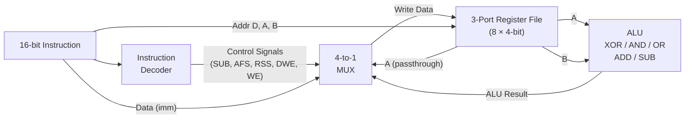
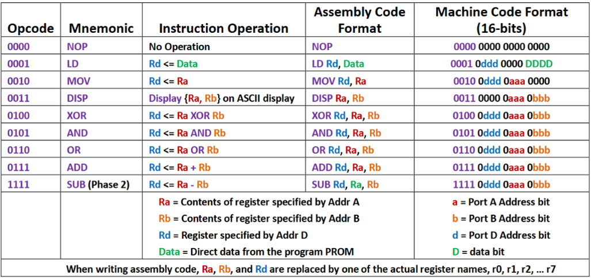
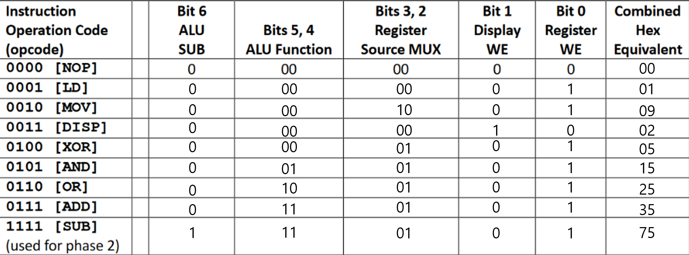
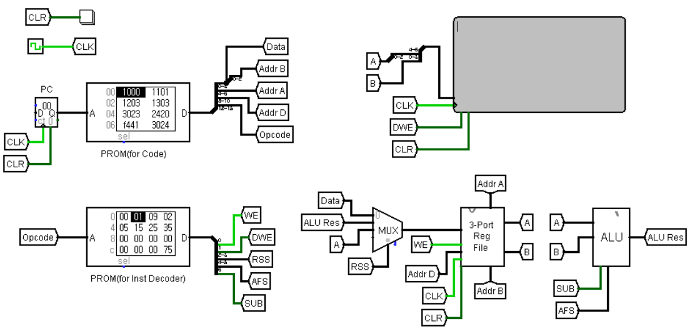
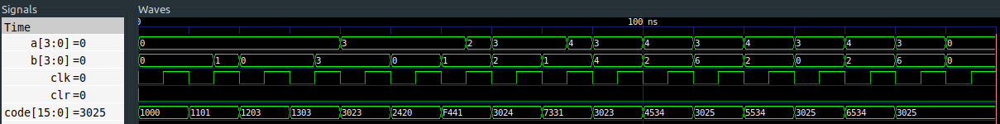

# 4-Bit CPU

[한국어](README-ko.md)

A fully functional 4-bit CPU designed from scratch using **Logisim** (visual circuit) and **Verilog HDL** (simulation).

This project was inspired by a circuit from [Electronics Stack Exchange](https://electronics.stackexchange.com/questions/367541/how-to-write-a-program-for-4-bit-cpu-made-in-logisim). The original circuit had issues when replicated, so it was fixed and improved. The instruction set and instruction decoder mapping were designed independently.

## Architecture

The CPU follows a **single-cycle** design — each instruction completes in one clock cycle.



### Components

| Component | Description |
|-----------|-------------|
| **Instruction Decoder** | Decodes 4-bit opcode into 7-bit control signals (SUB, AFS, RSS, DWE, WE) |
| **3-Port Register File** | 8 general-purpose 4-bit registers (R0–R7), 2 read ports + 1 write port |
| **ALU** | 4 operations — XOR, AND, OR, ADD/SUB (two's complement subtraction) |
| **4-to-1 MUX** | Selects write-back source: immediate data, ALU result, or register value |
| **8-to-1 MUX** | Selects register output for read ports |
| **3-to-8 Decoder** | Converts register address to one-hot enable signal |

## Instruction Set

16-bit instruction format:

```
[15:12]  [11]  [10:8]  [7]  [6:4]  [3]  [2:0]
opcode    -    Addr D   -   Addr A   -   Addr B / Data
```

| Opcode | Mnemonic | Operation | Assembly Format | Machine Code |
|--------|----------|-----------|-----------------|--------------|
| `0000` | NOP | No operation | `NOP` | `0000 0000 0000 0000` |
| `0001` | LD | Rd ← Data | `LD Rd, Data` | `0001 0ddd 0000 Data` |
| `0010` | MOV | Rd ← Ra | `MOV Rd, Ra` | `0010 0ddd 0aaa 0000` |
| `0011` | DISP | Display (Ra, Rb) on ASCII display | `DISP Ra, Rb` | `0011 0000 0aaa 0bbb` |
| `0100` | XOR | Rd ← Ra XOR Rb | `XOR Rd, Ra, Rb` | `0100 0ddd 0aaa 0bbb` |
| `0101` | AND | Rd ← Ra AND Rb | `AND Rd, Ra, Rb` | `0101 0ddd 0aaa 0bbb` |
| `0110` | OR | Rd ← Ra OR Rb | `OR Rd, Ra, Rb` | `0110 0ddd 0aaa 0bbb` |
| `0111` | ADD | Rd ← Ra + Rb | `ADD Rd, Ra, Rb` | `0111 0ddd 0aaa 0bbb` |
| `1111` | SUB | Rd ← Ra - Rb | `SUB Rd, Ra, Rb` | `1111 0ddd 0aaa 0bbb` |

### Instruction Decoder Control Signals

Each opcode maps to a 7-bit control word:

| Bit | Signal | Description |
|-----|--------|-------------|
| 6 | SUB | ALU subtraction flag |
| 5:4 | AFS | ALU function select (00=XOR, 01=AND, 10=OR, 11=ADD/SUB) |
| 3:2 | RSS | Register source MUX select |
| 1 | DWE | Display write enable |
| 0 | WE | Register write enable |




## Project Structure

```
├── 4-bit-cpu.circ            # Logisim circuit file
├── cpu.v                     # CPU top module (instruction decoder + datapath)
├── alu.v                     # Arithmetic Logic Unit
├── three_port_reg_file.v     # 8 x 4-bit register file with 3 ports
├── cpu_tb.v                  # Testbench with sample program
├── mux_4to1.v                # 4-to-1 multiplexer
├── mux_8to1.v                # 8-to-1 multiplexer
├── decoder_3to8.v            # 3-to-8 one-hot decoder
├── fulladder.v               # Full adder
├── Instruction.txt           # Sample program listing
└── images/
    ├── Instruction-Set.png
    ├── Instruction-Operation-Code(opcode).png
    ├── logisim_main.png
    └── verilog_cpu_tb.png
```

## Logisim Circuit

The Logisim implementation includes a **Program Counter (PC)** and two **PROMs** — one storing the program (instruction codes) and one storing the instruction decoder mapping. This makes it a fully self-contained, clock-driven CPU.



## Running the Verilog Simulation

### Prerequisites

- [Icarus Verilog](http://iverilog.icarus.com/) for compilation and simulation
- [GTKWave](http://gtkwave.sourceforge.net/) for waveform viewing (optional)

### Build & Run

```bash
iverilog -o cpu.vvp cpu_tb.v
vvp cpu.vvp
```

### View Waveforms

```bash
gtkwave cpu.vcd
```

## Example Program

The testbench (`cpu_tb.v`) runs the following program:

```asm
LD  $0, 0           # R0 = 0          (0x1000)
LD  $1, 1           # R1 = 1          (0x1101)
LD  $2, 3           # R2 = 3          (0x1203)
LD  $3, 3           # R3 = 3          (0x1303)
DISP $2, $3         # Display R3 → 3  (0x3023)
MOV $4, $2          # R4 = R2 = 3     (0x2420)
SUB $4, $4, $1      # R4 = 3 - 1 = 2  (0xF441)
DISP $2, $4         # Display R4 → 2  (0x3024)
ADD $3, $3, $1      # R3 = 3 + 1 = 4  (0x7331)
DISP $2, $3         # Display R3 → 4  (0x3023)
XOR $5, $3, $4      # R5 = 4 ^ 2 = 6  (0x4534)
DISP $2, $5         # Display R5 → 6  (0x3025)
AND $5, $3, $4      # R5 = 4 & 2 = 0  (0x5534)
DISP $2, $5         # Display R5 → 0  (0x3025)
OR  $5, $3, $4      # R5 = 4 | 2 = 6  (0x6534)
DISP $2, $5         # Display R5 → 6  (0x3025)
```

**Expected display output:** `3, 2, 4, 6, 0, 6`

### Simulation Waveform



## References

- [How to write a program for 4-bit CPU made in Logisim — Electronics Stack Exchange](https://electronics.stackexchange.com/questions/367541/how-to-write-a-program-for-4-bit-cpu-made-in-logisim)
- [Verilog 4-to-1 MUX — ChipVerify](https://www.chipverify.com/verilog/verilog-4to1-mux)

## License

MIT
